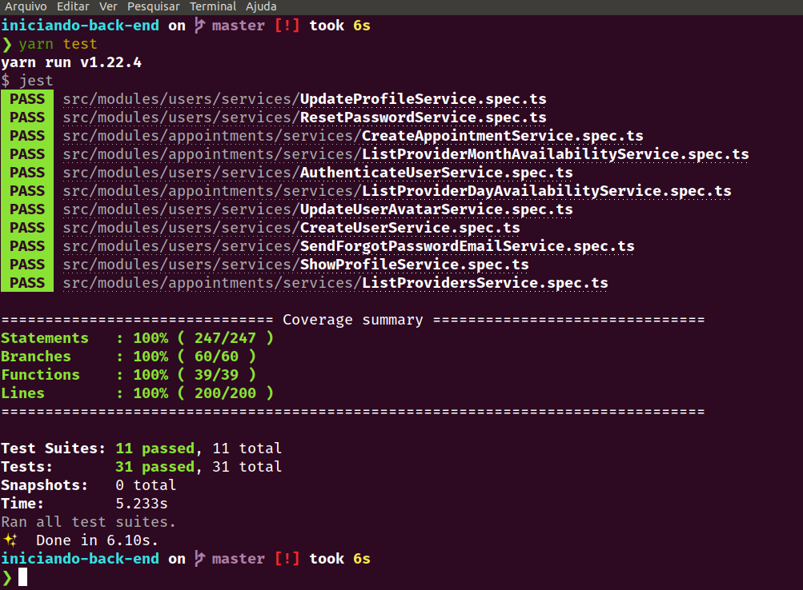

<h1 align="center">
  🚀️ Back-end 💈️💇‍♂️️ GoBarber 💅️✂️
</h1>

<p align="center">
  

  

  

  <br>

  <a href="https://app.codacy.com/manual/jerp86/iniciando-back-end?utm_source=github.com&utm_medium=referral&utm_content=jerp86/iniciando-back-end&utm_campaign=Badge_Grade_Dashboard">
    
  </a>

  

  <a href="https://www.linkedin.com/in/jerp/">
    
  </a>
</p>

---

<p align="center">
  
</p>

---

# Indice

- :rocket: [Sobre o Projeto](#rocket-sobre-o-projeto)
- 👨‍💻️ [Tecnogias utilizadas](#%EF%B8%8F-tecnogias-utilizadas)
- 📦️ [Como baixar o projeto](#%EF%B8%8F-como-baixar-o-projeto)
- 🤔️ [Como contribuir](#%EF%B8%8F-como-contribuir)

---

## :rocket: Sobre o Projeto

A proposta do curso **Bootcamp GoStack** da [Rocketseat](https://rocketseat.com.br/) é desenvolver uma aplicação completa para barbearias e salões de beleza chamada GoBarber, onde os prestadores de serviço possam informar seus dias e horários disponíveis para o trabalho, enquanto os clientes possam optar pelo profissional que melhor se enquadre em sua escolha de dia e horário.

O **Iniciando Back-end** é a construção do que será o Back-end do projeto final curso, o 💈️💇‍♂️️ **GoBarber** 💅️✂️.

Este projeto de Back-end será desenvolvido em Node.js com TypeScript no formato RESTFull utilizando as metodologias [DDD (Domain Driven Design)](https://en.wikipedia.org/wiki/Domain-driven_design) e [TDD (Test Driven Development)](https://pt.wikipedia.org/wiki/Test-driven_development).

---

## 👨‍💻️ Tecnogias utilizadas

O projeto foi desenvolvido utilizando as seguintes tecnologias:

- [Node.js](https://nodejs.org/)
- [TypeScript](https://www.typescriptlang.org/)

### Dependências

  - [Express](https://expressjs.com/)
  - [Cors](https://developer.mozilla.org/pt-BR/docs/Web/HTTP/Controle_Acesso_CORS)
  - :calendar: [Date-fns](https://date-fns.org/)
  - :closed_lock_with_key: [BCrypt](https://github.com/kelektiv/node.bcrypt.js)
  - [JWT](https://jwt.io/)
  - :file_folder: [Multer](https://github.com/expressjs/multer)
  - :id: [UUIDv4](https://github.com/thenativeweb/uuidv4)
  - :black_joker: [Jest](https://jestjs.io/)
  - :syringe: [TSyringe](https://github.com/microsoft/tsyringe)
  - :wavy_dash: [Handlebars](https://handlebarsjs.com/)
  - :incoming_envelope: [Nodemailer](https://nodemailer.com/about/)
  - :tada: [Celebrate](https://github.com/arb/celebrate)
  - [DotEnv](https://github.com/motdotla/dotenv)
  - [Class-Transformer](https://github.com/typestack/class-transformer)
  - [AWS-SDK](https://aws.amazon.com/pt/sdk-for-node-js/)
  - [Mime](https://github.com/broofa/mime)
  - [IoRedis](https://github.com/luin/ioredis)
  - [Rate-Limiter-Flexible](https://github.com/animir/node-rate-limiter-flexible)

### Banco de Dados
  - :elephant: [PostgreSQL](https://www.postgresql.org/)
  - [MongoDB](https://www.mongodb.com/)
  - [Redis](https://redis.io/)
  - [DBeaver](https://dbeaver.io/)
  - :whale: [Docker](https://www.docker.com/)
  - [TypeORM](https://typeorm.io/)

### Padronização de código

  - [ESLint](https://eslint.org/)
  - [Prettier](https://prettier.io/)
  - :mouse: [Editor Config](https://editorconfig.org/)

### IDE

  - [Visual Studio Code](https://code.visualstudio.com/)

---

## 📦️ Como baixar o projeto

Para copiar o projeto, utilize os comandos:

```bash
  # Clonar o repositório
  ❯ git clone https://github.com/jerp86/iniciando-back-end.git

  # Entrar no diretório
  ❯ cd iniciando-back-end
```
Para instalar as dependências e iniciar o projeto, você pode utilizar o Yarn ou NPM:

**Utilizando yarn**

```bash
  # Instalar as dependências
  ❯ yarn

  # Iniciar o projeto
  ❯ yarn dev:server
```

**Utilizando npm**

*PS: Caso utilize o NPM, apaque o arquivo `yarn.lock` para ter todas as dependências instaladas da melhor forma.*

```bash
  # Instalar as dependências
  ❯ npm install

  # Iniciar o projeto
  ❯ npm dev:server
```

---

## 🤔️ Como contribuir

1. Faça o `fork` deste repositório
2. Crie uma branch com sua feature:
   - `$ git checkout -b minha_feature`
3. Confirme sua branch:
   - `$ git commit -m "feature: Meu novo recurso"`
4. Envie sua branch:
   - `$ git push origin minha_feature`

---

<h4 align="center">
  Feito com ❤️ por Jerp86 👋️ <a href="mailto:jerp4@hotmail.com">Entre em contato!</a>
</h4>

<p align="center">
  <a href="https://www.linkedin.com/in/jerp/">
    
  </a>
  <a href="https://www.facebook.com/jerpbtu">
    
  </a>
  <a href="https://www.instagram.com/jerpbtu/">
    
  </a>
  <a href="https://twitter.com/jerpbtu">
    
  </a>
</p>
